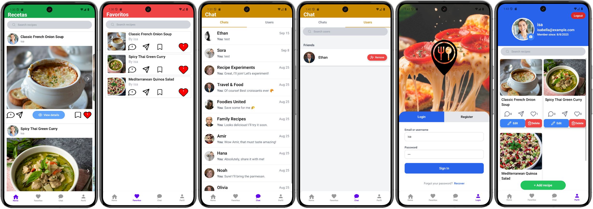

# 📱 Recetario

## 🚀 Project Overview
Recetario is a **full-stack social app** focused on **sharing and discovering recipes**.  
The main goal is to create a platform for **social interactions** around cooking.

## 🛠️ Tech Stack
- **Frontend:** React Native with Expo
- **State Management:** Zustand
- **Database:** PostgreSQL
- **Database Browser:** Adminer
- **Development Environment:**
  - Windows 11 with **VS Code**
  - WSL (Windows Subsystem for Linux) for running PostgreSQL + Adminer
  - Android Studio for device visualization & debugging
  - Supabase S3 for images storage.

## 📂 Features 
- User authentication
- Recipe sharing
- Social interactions (likes, comments, chat etc.)
- Database-driven recipe storage
- Mobile-first design

---
